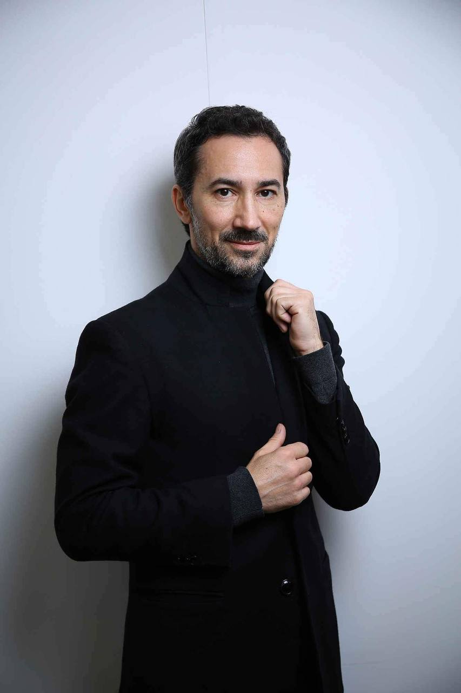

# 🎇 CTO

Stephen Gracey

以結果為導向的業務領導者，在 IT 和互聯網技術方面擁有7 年以上的創業經驗。

&#x20;

2015年底開始關注數字資產，成為加密愛好者。

對他來說，區塊鏈技術、比特幣、以太坊和智能合約已經成為他必須參與的變革的體現。

&#x20;

&#x20;

Stephen 一直積極參與加密貨幣交易和區塊鏈投資組合管理，在各種加密貨幣交易所成功進行了 1000 多次高頻交易。

從項目概念、代幣經濟和營銷策略的開發到吸引投資、代幣交換和在加密貨幣交易所上市。

&#x20;

目前，斯蒂芬是使用區塊鏈技術和代幣化的項目和初創公司的顧問和私人投資者。

他還是一位經驗豐富的IDACB 的成員；定期作為專家參加行業區塊鏈會議和活動。

作為初創公司的顧問和戰略家，其想法和策略幫助項目吸引投資、進入市場並取得成功，

Stephen Gracey 負責制定 One3 Game Fi 的產品策略，並負責產品開發、用戶體驗、業務開發。

<figure><figcaption></figcaption></figure>
