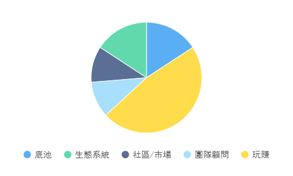

# 💰 13C

**What is 13C？**

The token of 13 Coin is 13, abbreviation: $13, is a BEP-20 token with a fixed supply, the maximum supply is 100,000,000 pieces, which is 13's governance, utility and special Play -to-Earm reward token.

Total circulation: 100,000,000 pieces

Allocation Mechanism:

Angel Agency: 5%&#x20;

Pot: 15%&#x20;

Ecosystem: 15%&#x20;

Community/Market: 10%

Team advisor: 10% (lock up for one year)&#x20;

Play and earn: 45%

<figure><figcaption></figcaption></figure>

We will set up the protection pool and the pot through the contract mechanism

1. 10% of the tokens purchased by the player will be used to support the repurchase, stabilize the currency price, and ensure the stable and appreciation of the currency price
2. 15% of the tokens purchased by the player will be used to build the pot, which is increasing day by day
