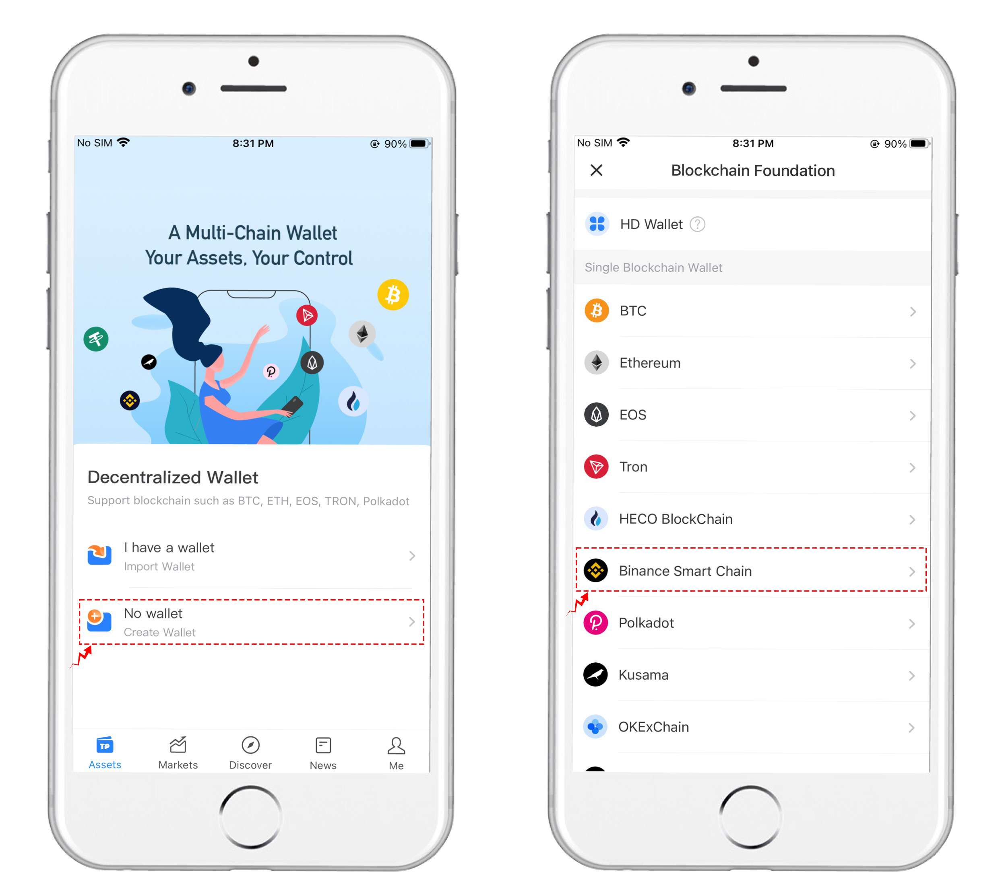
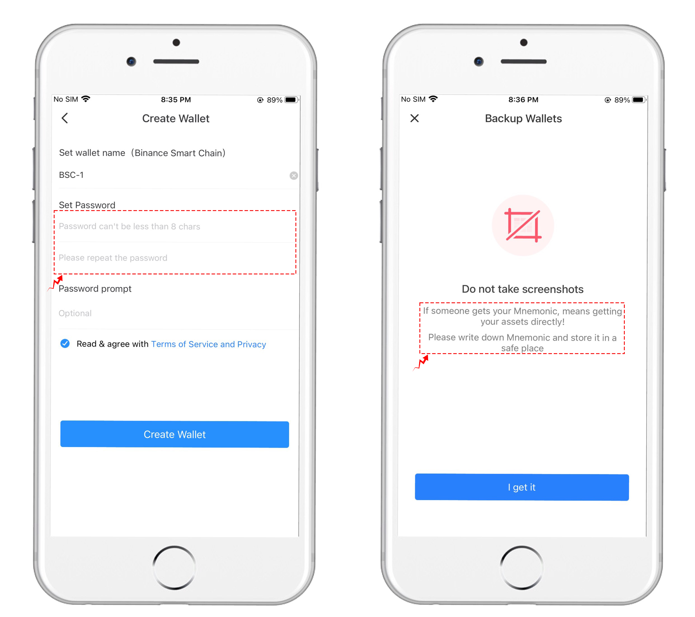
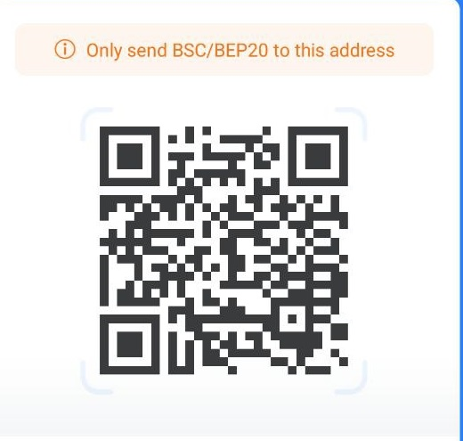

# 🎰 Start

**Create Account**

\
At present, One3 GameFi adopts a whitelist invitation system, and only users who have obtained the whitelist registration link can register and enter the game.&#x20;

Official invitation link address: After entering the official website through the invitation link, you can choose  a combination of numbers and characters, or log in directly with your Tokenpocket and Google email.

**Stored value**

After logging in, click the recharge button in the upper right corner, and the recharge interface will pop up.

**TP Wallet Teaching**&#x20;

ONE3 GameFi is a project based on the BSC chain. Players first need to create a BSC address. Game You can use TP wallet to create addresses.&#x20;

Tokenpocket download address: https://www.tokenpocket.pro/zh/download/app&#x20;

(1) After installation, new users can directly click \[I don't have a wallet] to select Binance Smart Chain to create. (Old users can click \[I have a wallet] and use mnemonic words or private keys to import)

<figure><figcaption></figcaption></figure>

(2) Click the "Create" wallet button, then enter the wallet name and password in turn, and click the "Create wallet" button below after the input is complete.&#x20;

Then back up the mnemonic, you can copy the mnemonic into a notebook, copy at least two copies and keep them in different locations. The creation of the Binance Smart Chain wallet is completed after the mnemonic backup is successful.

<figure><figcaption></figcaption></figure>

（3）Transfer and collection.&#x20;

&#x20; After creating a Binance Smart Chain wallet, you can use the wallet account to transfer money, direct transfer, address book transfer and scan code transfer are all available

<figure><figcaption></figcaption></figure>

(2) Collection. Copy the address or share it with the Token issuer.

<figure><figcaption></figcaption></figure>

<mark style="color:red;">Remember, no website will ever need your mnemonic or private key!</mark>

&#x20;<mark style="color:red;">One3 Game Fi will not ask you for your mnemonic or private key under any circumstances!</mark>
