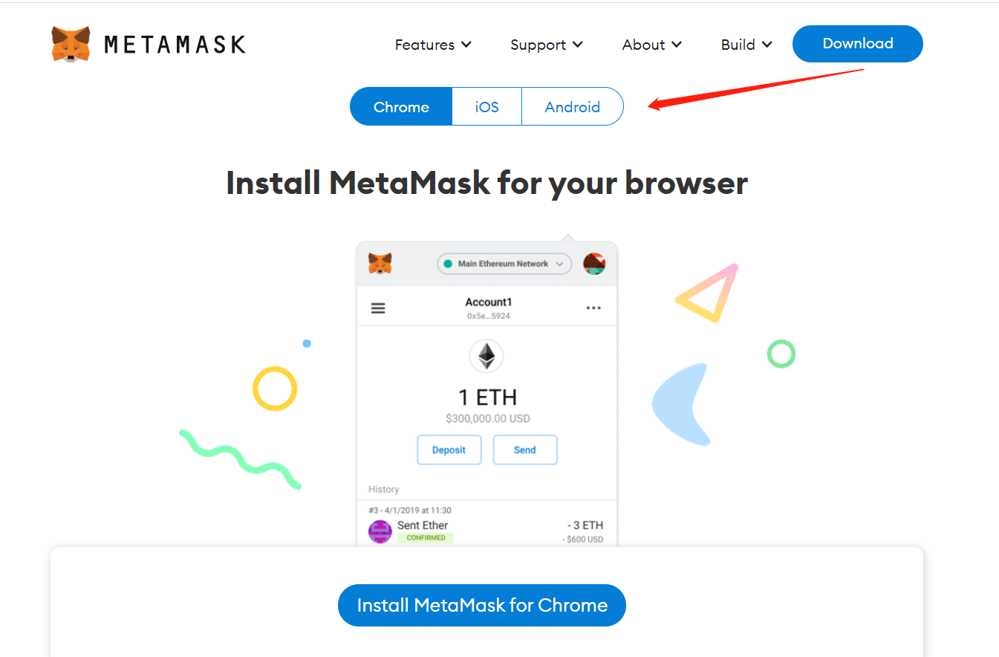
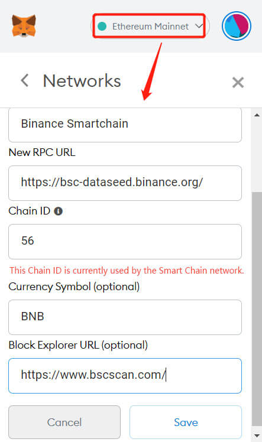

# 🎰 開始遊戲

**創建賬戶**

目前One3 GameFi采用白名單邀請製，僅有獲得白名單註冊鏈接的用戶可以註冊並進入遊玩。

官方邀請鏈接地址：

通過邀請鏈接進入官網後，您可以選擇使用電子郵箱、電話號碼或者數字字符組合ID創建賬戶，或者直接使用小狐貍賬戶和谷歌郵箱登入。

**儲值**

登入後點擊右上角充值按鈕，彈出儲值界面。

**上級綁定地址教程**

1\. 從邀請鏈接地址：XXXXX           進入官網會自動綁定上級

2\. 直接進入官網，進入用戶中心-邀請好友綁定上級地址

**提現說明**

您需要提取對應的資源，請先綁定您的提現地址。 登入後點擊右上角充值按鈕，彈出儲值界面。

從左側選單中點擊提現切換到提現界面並綁定您的提現地址。 亦可從用戶中心->我的代幣->對應代幣提現界面跳轉。

**小狐狸錢包教學**

ONE3 GameFi是一款基於BSC鏈的項目，玩家首先需要創建一個BSC地址。遊戲您可以使用小狐狸MetaMask來創建地址。

**步驟一:下載與安裝**

Metamask下載鏈接

點擊以上鏈接跳轉作业系统选择页面

<figure><figcaption></figcaption></figure>

安裝完整後，與瀏覽器右上角中點擊小狐狸圖標，即可導入或者創建您的錢包。

**步驟二：添加BSC鏈**

<figure><figcaption></figcaption></figure>

依次填寫表單中内容后保存：

Network: Binance Smartchain

RPC URL：https://bsc-dataseed.binance.org/

ID：56

Symbol: BNB

URL：https://www.bscscan.com/

您可以看幣安智能鏈上的其他選項， 您可以將您擁有的其他BSC賬戶私鑰導入小狐狸錢包中。

<mark style="color:red;">記住，任何網站都不可能會需要用到您的助記詞或私鑰！</mark>

<mark style="color:red;">One3 Game Fi在</mark><mark style="color:red;">**任何情形**</mark><mark style="color:red;">下不會向您索要您的的助記詞或私鑰！</mark>
