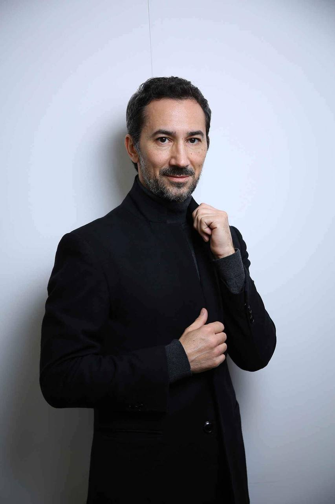

# ⛳ CTO

Results-oriented business leader with 12+ years of entrepreneurial experience in IT and Internet technologies. Focus on digital assets since the end of 2015, become a crypto enthusiast. For him, blockchain technology, bitcoin, ethereum and smart contracts have become the embodiment of the changes he has to be a part of.

Stephen has been actively involved in cryptocurrency trading and blockchain portfolio management with over 1000 successful trades on various crypto exchanges. He has personally invested in more than 20 ICOs, successfully exited and participated in several crypto projects, from the development of project concepts, token economics and marketing strategies to attracting investment, token exchange and listing on crypto exchanges.

Currently, Stephen is an advisor and private investor in projects and startups using blockchain technology and tokenization. He is also an experienced ICO strategist, a member of the Bitcoin Foundation, IMMO High 1000 and IDACB; regularly attends industry blockchain conferences and events as an expert. As a consultant and strategist for blockchain companies and startups, whose ideas and strategies help projects attract investment, enter the market, and succeed, Stephen has participated in more than 15 ICOs, several STO projects, and projects funded using VCs.

Stephen is responsible for developing the product strategy for One3 Game Fi and is responsible for product development, user experience, business development, editorial, content creation and customer operations.

<figure><figcaption></figcaption></figure>
