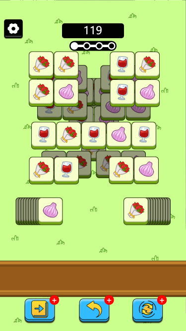
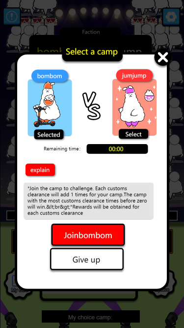

# 🐏 Cazy Sheep

Drawing on a variety of match-3 games, we hope that players do not need game operation skills, do not need to understand complex economic model design, and do not need to master Web3-related technical knowledge. Players do not need to enter the game threshold, or in the game content and operation interaction. to be as simple as possible.

<figure><figcaption></figcaption></figure>

After the player buys the platform token and gets a certain amount of platform token, they can start the game. With the classic square icon as the animation background, the player can pass the level by eliminating the square icon. Players can remove the selected icons by selecting three of the same classic block icons. There are a total of 7 slots at the bottom of the game, and players only need to move 3 identical icons into the slots and they will be eliminated. The icons in the game are constantly overlapping, and the player can only select the icon on the top layer.&#x20;

Players can eliminate obstacles and traps in the level by tokenizing, sharing and watching advertisements. If you fail to pass the level, there is also a chance to be resurrected. After passing the two levels, players will have the probability to obtain NFTs, props and token rewards of different rarities. Different NFTs have different skills. After the official website market is opened, NFTs and props can also be auctioned in the market to earn profits.

<figure><figcaption></figcaption></figure>

